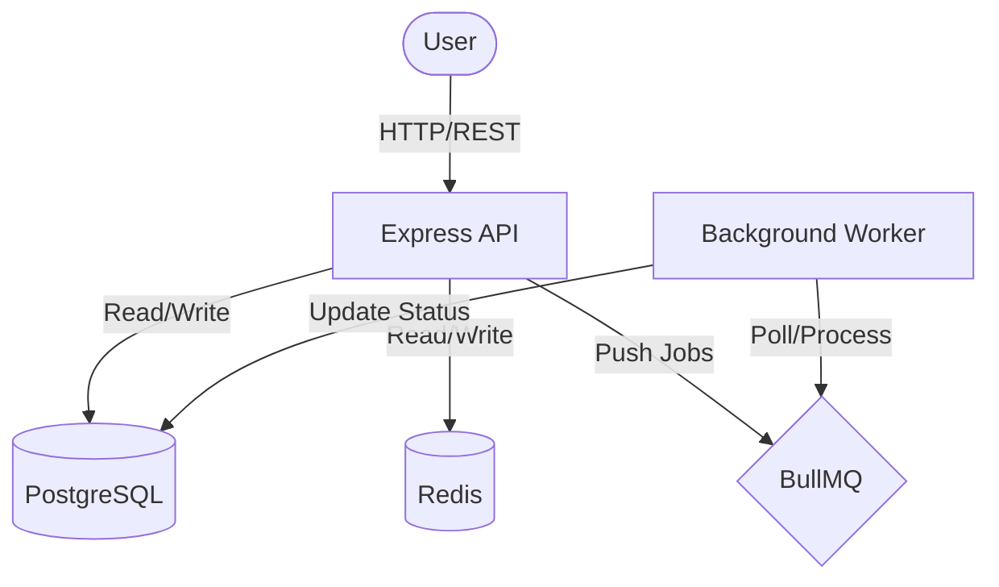

# Architecture

## System Diagram

## Components

### 1. API Server (Express)

- Handles HTTP requests.
- Validates input using Zod.
- Manages authentication via JWT.
- Routes requests to appropriate controllers.
- Interfaces with PostgreSQL via Prisma for data persistence.
- Interfaces with Redis for caching public content.

### 2. Database (PostgreSQL)

- Stores users, posts, and post revisions.
- Uses normalized schema.
- Indexes on frequently queried fields (`status`, `authorId`, `scheduledFor`).

### 3. Cache (Redis)

- Stores serialized published posts for fast retrieval.
- Keys: `post:{id}` for individual posts, `published_posts:{page}:{limit}` for lists.
- TTL: 1 hour for individual posts, 5 minutes for lists.
- Invalidation: Cache is cleared when a post is updated, deleted, or published.

### 4. Background Worker (BullMQ + Cron)

- Periodic job (`check-scheduled`) runs every minute to find past-due scheduled posts.
- Adds publishing tasks to the queue.
- Processes publishing tasks transactionally to update post status (`SCHEDULED` -> `PUBLISHED`).

## Design Decisions

- **Adapter-Based Prisma**: Utilizes `@prisma/adapter-pg` for efficient connection pooling.
- **Queue-Based Scheduling**: Decouples the scheduling logic from the API request cycle, ensuring reliability.
- **Revisions**: Implemented as a separate table `PostRevision` to keep the main `Post` table clean and performant.
- **Strict Role Separation**: Public routes are distinct from Author routes to prevent accidental data leaks.
